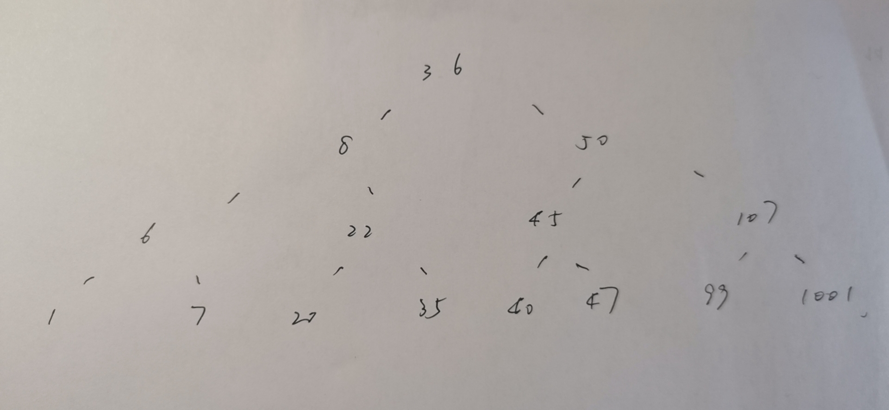

# ICS-Lab2说明文档

19302010020袁逸聪

## phase_1

运行后来到phase_1，disas看到

将立即数0x4023b0传入%esi后，调用了strings_not_equal，并test返回值

返回1则引爆炸弹，0则结束函数

猜测是将输入与预存的string相对比，相同通过、不同引爆

x/s 0x4023b0查看，得到预存字符串"Houses will begat jobs, jobs will begat houses."

disas strings_not_equal看到

1. 输入字符串与预存字符串的地址分别被移到%rbx、%rbp
2. 先后调用string_length并比较结果，长度不同则返回1
3. 逐字符比较了两个字符串，发现不同字符则返回1
4. 长度相同、都相同，可以返回0

故，phase_1的密码就是与预存字符串相同的输入

## phase_2

disas phase_2看到它调用了read_six_numbers，可知输入为6个数字

接下来比较0x0与(%rsp),能看到%rsp中储存的正是首个输入数所在地址，其余输入紧随其后

比较限制了输入数需要>0，否则引爆炸弹

在<+71>处，看到%ebx与6比较，不等将跳转，等则结束函数。而对ebx既有的操作是初始化赋值1与<+64>处的+1，可知将有5次循环，从1到5

可以推断，这是循环控制器，phase_2将对6个输入数进行操作：

1. 从<+49>到<+54>为关键部分
2. 将%eax中值写为当前轮次+当前考察的输入数
3. 将%eax储存的计算结果与下一个输入数比较，不相等引爆、相等通过
4. 第i个输入数与第i+1个输入数的差需要为i

故，phase_2的密码为首项不为0的6项数列，且a(i+1)=ai+1，如1 2 4 7 11 16

## phase_3

disas phase_3看到在扫描输入前，为%esi赋值了0x4025af

x/s查看其储存内容为"%d %d"，可知输入为2个数字，以下简称为A、B

输入数储存在%rsp所指处，函数先将A与7比较，大于7则引爆。故输入A应小于等于7

<+57>跳转到0x402420+A*8处

- print *0x402420@20能够发现，数组中储存的是phase_3代码段地址

故此处应为对A的switch判断

反复出现到<+130>的跳转，可以推测为break之后的代码

<+130>处比较了%eax与B，相等则通过，B是第二个输入数，返回去看%eax如何决定

发现在各个switch分支中，为%eax赋予了不同的数值

A取1~7时对应B输入为：294 813 627 250 340 106 81，任取一组即可

## phase_4

先检测了函数参数是否达到2个，如果只有一个参数会引爆

- 将第二个参数给%eax
- %eax-=2
- %eax与2比较，要求无符号≤，即输入的第二个参数k要满足2<=k<=4

再关注函数末尾，将第一个参数与%eax比较，要求相等否则爆炸

可知我们需要根据第二个参数，推出对应的%eax最终值，写在第一个参数中以通过测试

<+59>~<+67>三行，将第二个参数赋给%esi、7赋给%edi，并调用了func4

看来func4的返回值就是要找的答案，%esi和%edi保存的可能是func4的参数

来到func4：

- %edi为0，则返回0，可见%edi不会一直是7，一定有所更改
- %esi存入%eax，即我们输入的第一个参数
- 将%edi与1比，为1则直接返回。看起来像递归函数的结束条件，index为1时直接返回
- 在%ebp中保存了%esi，而在%ebx中保存了%edi。可知输入参数在：%ebp、%esi；固定参数在：%edi、%ebx
- 将%edi-1后再次调用func4，和最初的参数相加给了%r12d
- 将%rbx-2给%edi后再次调用func4，相当于对一开始的%edi-2，又和%r12d相加

至此可以确定，原函数是一个递归函数，一个参数为基数(用户输入)、一个参数为轮次(在phase_4中固定传入7)

函数递归定义式如下：

> func4(i+2)=func4(i+1)+func4(i)+基数
> func4(1)=基数
> func4(0)=0

而基数规定了要在2~4之间

故可选输入为132 4 or 99 3 or 66 2

## phase_5

x/s查看0x4025af发现输入格式要求同样为"%d %d"即两个数字

<+48>~<+57>将第一个输入与0xf做与，相当于mod16，并要求不等于15

接下来的循环中，引人注目地访问了0x402460(,%rax,4)

print发现0x402460中连续的存储了0~15，共16个数，相当于访问以%rax为索引的数组

接下来看如何通过检测，要求%edx等于15，而第二个参数等于%ecx

- %edx初始赋0，在<+72>处+1，可见是个计数器
- %ecx初始赋0，在<+84>处+%eax，那么就接着考虑%eax的内容
- %eax的内容来自于对0x402460处数组Array[%eax]的访问
- 若%eax的值非15，将继续循环，若是15，进入检测环节

也就是说，第一个输入数是最初的索引，15次循环中，访问数组的结果累加到%exc上，而第二个参数则要给出累加结果

| index |0|1|2|3|4|5|6|7|8|9|10|11|12|13|14|15|
| ----- | ----- | ----- | ----- | ----- | ----- | ----- | ----- | ----- | ----- | ----- | ----- | ----- | ----- | ----- | ----- | ----- |
|content|10|2|14|7|8|12|15|11|0|4|1|13|3|9|6|5|

根据数组内容，可以推测是首个索引为5(首个访问结果为8，也是下一个索引)时，将在进行15论后访问到15，跳出循环。此时累加结果为115。

故答案为5 115

## phase_6

又捡到了read_six_numbers，输入格式为6个数字

### 输入合法性检测

<+34>~<+67>部分：

1. 将参数地址储存在%r12中，初始化%r13d为0，充当计数器
2. 根据%r12拿到首个参数，值-1后与5比较，只有小于等于5才能免于引爆。即要求首参≤6(无符号比较潜在地要求了≥1)
3. 比较结束后%r13d++，若等于6则跳转。可见要做六次比较

<+73>~<+98>部分：

1. 初始化%ebx为%r13d，嵌套for循环
2. 比较输入数组的首位和[%ebx]位，要求二者不同
3. 使用后%ebx+1，若≤5则循环，也就是说最后一个起作用的%ebx是5
4. 输入6个数，array[5]即为最后一个数
5. 故这个部分检测首位与后面各位数不相同

<+100>~<+104>部分：

1. 将%r12递增4，根据%r12获取的"首个参数"也就将变为原本的第二个参数
2. 强制跳转回第一部分，检测现在考察的参数是否在1~6中
3. 进入第二部分检测现在的参数不与之后的参数相同

到此，合法性检测部分要求6个输入数在1~6之间，且各不相同

即允许的输入是1 2 3 4 5 6的排列

### 数据结构操作部分

完成所有检测后，从上述第一部分的3.中跳转到<+134>，不过从<+106>开始就需要考虑(因为不属于合法性检测)

<+134>~<+157>部分：

1. 初始化%esi为0
2. 访问首个参数地址+%esi赋值给%ecx，%esi的值需要是数组index*4
3. 初始化%eax为1，%edx为0x6032f0

查看0x6032f0,发现是一串有规律数据的首地址

> 以0x6032f0为index=0的地址，每格对应地址为0x6032f0+index*4

|index|0|1|2|3|4|5|6|7|8|9|10|11|12|13|14|15|16|17|18|19|20|21|22|23
| ----- | ----- | ----- | ----- | ----- | ----- | ----- | ----- | ----- | ----- | ----- | ----- | ----- | ----- | ----- | ----- | ----- | ----- | ----- | ----- | ----- | ----- | ----- | ----- | ----- |
|content|817|1|index4|0|888|2|index8|0|548|3|index12|0|347|4|index16|0|826|5|index20|0|729|6|0|0|

将4个数据视为一块，每块数据的4各部分分别储存了内容、序号、下一块数据的地址、空(以后成为第x块数据的内容、序号、指针部分)

- 将%ecx中储存的[%esi/4]输入值与1比较，＞跳转到<+106>，否则到<+117>

<+106>~<+115>小循环：

1. 将%rdx中内容+8，第一次进入，%rdx储存的是index0指向第一块数据，+8后变为第1块数据的指针部分，指向的是第二块数据
2. 用%eax充当计数器，循环操作%ecx次，%ecx中是所输入的内容，根据%esi值的不同取不同位次，首次为首个输入数
3. 再次循环时，访问到的将是第二块数据，+8后得到指向第三块数据的指针
4. 如此循环，如本次考虑的输入数为i，则将最终指向第i块数据，而后进入<+117>部分(%ecx为1时将直接进入<+117>，小循环运作次数为%ecx-1次)

<+117>~<+132>循环：

现在，%rdx指向的数据块，其序号将与当前正在考虑的输入数字相同

1. 首先关注计数器%rsi，每次+4，达到24后跳转到<+159>，之后再说明。否则将调回<+139>,即本粗体标题下第一个说明的部分。结合之前%esi的角色，可知这次计数器将使下一次考虑下一个输入数，直到6个输入数都被考虑过
2. <+117>行中，将%rdx所储存的数据块指针存入输入数之后，即按输入数顺序储存了指向第1-6的指针(可能是因为在64位系统运行，储存的排列并不紧密，每隔开1单位空间才存一个数)

结束循环来到<+159>：

- 将储存指针的首地址传给了%rax，最后一个地址传给%rsi。此时指针的存储顺序对应输入数(如输入6 5 4 3 2 1，则指针存储为第6 第5 ... 第1)，而第一个储存的指针传给%rbx与%rcx

<+177>~<+192>循环:

1. 将%rax所指数据块的指针给%rdx和第一个指针所指向的数据块指针处(若输入值为6 3 ...，此时指向3号数据块的指针存入了第六块数据块的指针部分)
2. %rax+8,即第一个数据块已经被操作完成，考察考察下一组
3. 将%rdx保留的指针传给%rcx，将%rcx保存的首个指针也更新到下一个
4. 比较%rax与%rsi中保存的最后一个指针，以确保每个数据块的指针部分都经过了上述操作

经过上述操作，原本数据块中的指针顺序为1->2->...->5->6

现在按照输入的6个数重新排序了

### 答案检测部分

<+197>~<+216>部分：

此时%rbx中储存的6个指针的首地址，按输入顺序排列

1. 将最后一个数据块的指针部分清零，真正完成重新排列
2. %ebp赋值5，在<+229>出现%ebp-1，可见应该是计数器
3. 利用%rbx取出排序后第一第二个代码块的内容值，并要求第一个≥第二个，否则引爆
4. 将%rbx指向下一个，循环比较5次

数据结构操作部分中，更改了数据块的指针部分，遍历顺序被重新设定为原始顺序按输入值重排

在答案检测部分中，按照新遍历顺序要求前者比后者大

故输入值需要使重排后，排在前面的值≥后面的值

根据表格初始数据：817、888、548、347、826、729

应按照2->5->1->6->3->4的顺序访问，才符合从大到小，故答案为2 5 1 6 3 4

## phase_defused&secret_phase

在bomb.c文件的最后，提示忽视了某些东西

bomb.c文件中read_line应只是读取工具，phase_x都完成拆除，但phase_defused不知道是干嘛的

disas phase_defused后发现它会调用secret_phase，接下来寻找隐藏关进入条件

### 如何触发

1. 向上倒推，进入secret需要通过strings_not_equal的测试，类似于phase_1，输入正确的字符串密码才行
2. <+44>行传入了"%d %d %s"字样字符串，结合phase_defused在每个phase后调用，应当是在拆弹的输入中额外增加一个字符串作为暗号
3. 第3、4、5关都是输入2个数字的，符合隐藏输入的要求
4. <strings_not_equal>被调用前，将0x402602赋值给%esi，查看后发现其中储存的是"DrEvil",故在3或4或5关额外输入"DrEvil"应当是触发隐藏关的暗号

watch <+49>被赋给%edi的0x603890，发现其中数据在第四关输入后发生变化。不过phase_defused中有0x2021d1(%rip)这样一个计数器，在每次拆弹后递增，等于6才会执行接下来的部分。虽然暗号值在第四关就输入并储存，但要到第六关结束的那次调用才会被判断。

在第四关额外输入DrEvil后正常通过六关，来到phase_defused时果然在0x10(%rsp)处找到了输入。它将被传给%rdi作为参数与设定好的暗号字符串对比，相等即可通过条件，调用secret_phase

### secret_phase

disas查看secret_phase

<+1>~<+30>部分：

首先进行了读入与比较，要求输入值-1后无符号≤1000，故输入值必须在1~1001范围(都可取)

<+42>~<+54>部分：

1. 将%ebx传入%esi、0x603110传入%edi后调用fun7，前二者应为参数。其中%ebx保存的就是我们的输入
2. 调用结束后要求返回值等于2，即可通过本关

查看0x603110发现一大串数组

以8个空间为一结点，共储存了15个结点

每个结点的1、3、5空间分别储存了数字、地址、地址

不难发现，每个节点的两个地址也都指向其他结点

爬指针后发现其中储存的应是这样一棵树：

也就明白了为什么输入必须在1~1001之间

### fun7

进入fun7，参数%esi中保存输入，%edi保存树的root地址

1. 比较输入值与当前所指结点
2. 输入小于结点值，则更改结点指针，指向左边的下一个节点，递归调用，并加倍返回值
3. 输入等于结点值，则返回0
4. 输入大于结点值，则更改结点指针指向右边的下一个节点，递归调用，并使返回值加倍再+1

故有fun7(输入,当前值){
    if(输入==当前值) return 0；
    if(输入<当前值) return fun7(输入,当前值.左子值);
    if(输入>当前值) return fun7(输入,当前值.右子值);
}

至于叶子结点的子值，则在<+4>~<+7>的判断跳转中给出：如果指针为空，则返回-1，故若输入值不是结点值，将返回负数，不可能通过检测

从与输入值相等的结点向上爬，初始值为0，往右为翻倍、往左为翻倍+1

想得到返回值2，就需要左、右

易知22是合适的输入。但由于从0往右还是0，右+左+右也可以返回2，20也是答案

故secret_phase答案为20或22，进入条件为在第四关额外输入"DrEvil"
